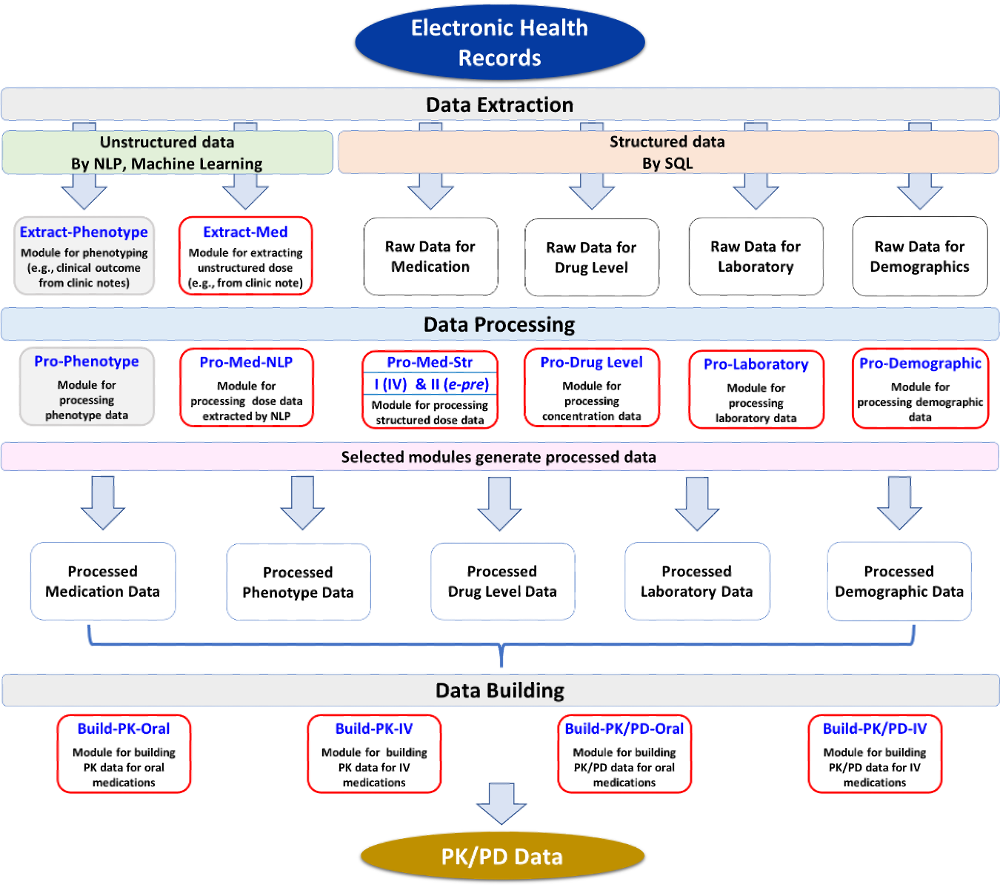

```{r setup, include=FALSE}
knitr::opts_chunk$set(echo = FALSE)

# Learn more about creating websites with Distill at:
# https://rstudio.github.io/distill/website.html

# Learn more about publishing to GitHub Pages at:
# https://rstudio.github.io/distill/publish_website.html#github-pages
#{width=10%}
```

<div>


<p align="right">
Leena Choi, PhD  
Professor of Biostatistics  
Vice Chair of Diversity and Inclusion  
Department of Biostatistics  
</p>
</div>

<p align="right">
<a href="https://www.vumc.org/biostatistics/person/leena-choi-phd">https://www.vumc.org/biostatistics/person/leena-choi-phd</a>
</p>

**The major research focus of our lab is to construct a system, called "*EHRtoPKPD*", for drug-related studies such as pharmacokinetics (PK), pharmacodynamics (PD), and pharmacogenomics (PGx) studies using electronic health records (EHRs). This system would allow to perform drug-related studie more efficiently by standardizing data extraction, data processing, and data building procedures. This system would provide a foundation for PK/PD-model guided clinical decision support systems embedded in EHRs to provide an optimal pharmacotherapy, the overarching goal of precision medicine.**

<div>
<figure class="rhs">

<figcaption>**The *EHRtoPKPD*, a System for PK/PD Studies using EHRs.**  
Modified from *Clin Pharm Ther 2020*.</figcaption>
</figure>
<map name="system">
<!--<area shape="rect" coords="" alt="Extract-Phenotype" href="">-->
<area shape="rect" coords="100,120,180,165" alt="Extract-Med" href="Extract-Med.html">
<!--<area shape="rect" coords="" alt="Pro-Phenotype" href="">-->
<area shape="rect" coords="100,200,180,245" alt="Pro-Med-NLP" href="Pro-Med-NLP.html">
<area shape="rect" coords="205,200,240,245" alt="Pro-Med-Str" href="Pro-Med-Str-Part1.html">
<area shape="rect" coords="245,200,285,245" alt="Pro-Med-Str" href="Pro-Med-Str-Part2.html">
<area shape="rect" coords="300,200,375,245" alt="Pro-Drug-Level" href="Pro-DrugLevel.html">
<area shape="rect" coords="393,200,470,245" alt="Pro-Laboratory" href="Pro-Laboratory.html">
<area shape="rect" coords="486,200,565,245" alt="Pro-Demographic" href="Pro-Demographic.html">
<area shape="rect" coords="35,407,112,452" alt="Build-PK-Oral" href="Build-PK-Oral.html">
<area shape="rect" coords="175,407,250,452" alt="Build-PK-IV" href="Build-PK-IV-simple.html">
</map>

*EHRtoPKPD* is a modular system, divided into the three major procedures: data extraction ("*Extract-*"), data processing ("*Pro-*"),  and data building ("*Build-*"). Modules were created or under development (gray color box) depending on the data element, task to perform, and type of PK/PD models. 

For drugs with complex prescription pattern, dose data obtained from e-prescription databases may not be accurate enough to perform PK/PD studies. For these drugs, we may need to extract drug dose information from clinical notes using a natural language processing (NLP) system. We developed a flexible and targeted NLP system that can directly extract drug dose information from clinical notes, which was incorporated into our system ([*Extract-Med*](Extract-Med.html)). 

Building drug dose data from extracted dose information can be challenging. To address these challenges, we developed a dose data building algorithm that was implemented in our system ([*Pro-Med-NLP*](Pro-Med-NLP.html)). 

For drugs with simple prescription pattern, dose data can be relatively easily extracted from e-prescription databases and processed using [*Pro-Med-Str*](Pro-Med-Str-Part2.html) module. 

Other data elements such as drug levels ([*Pro-Drug Level*](Build-PK-IV-comprehensive.html)), demographics ([*Pro-Demographic*](Build-PK-IV-comprehensive.html)), and laboratory data ([*Pro-Laboratory*](Build-PK-IV-comprehensive.html)) can be processed using our system. These data can be combined with processed dose data to build PK/PD data using PK/PD data building modules (i.e., [*Build-PK-IV*](Build-PK-IV-simple.html), [*Build-PK-Oral*](Build-PK-Oral.html)). 

The NLP system is available as an R package, *medExtractR*, and the functions to run each module are implemented as an R package, *EHR*. More details can be found in Choi *et al.*$^{1}$, and additional modules will be added in the future as it evolves.
</div>

### Lab Team

<table>
  <tr>
    <td>Cole Beck</td>
    <td>Elizabeth McNeer</td>
    <td><a href="https://michaelleewilliams.github.io">Michael Williams</a></td>
    <td><a href="https://www.ntjames.com/">Nathan T. James, ScM</a></td>
  </tr>
  <tr>
    <td></td>
    <td></td>
    <td></td>
    <td></td>
  </tr>
</table>

### Lab Alumni

<table>
  <tr>
    <td>Hannah L. Weeks</td>
  </tr>
  <tr>
    <td></td>
  </tr>
</table>

### References
1. Choi L, Beck C, McNeer E, Weeks HL, Williams ML, James NT, Niu X, Abou-Khalil BW, Birdwell KA, Roden DM, Stein CM. Development of a System for Post-marketing Population Pharmacokinetic and Pharmacodynamic Studies using Real-World Data from Electronic Health Records. Clinical Pharmacology & Therapeutics. 2020 Apr;107(4):934-43. doi: 10.1002/cpt.1787.
