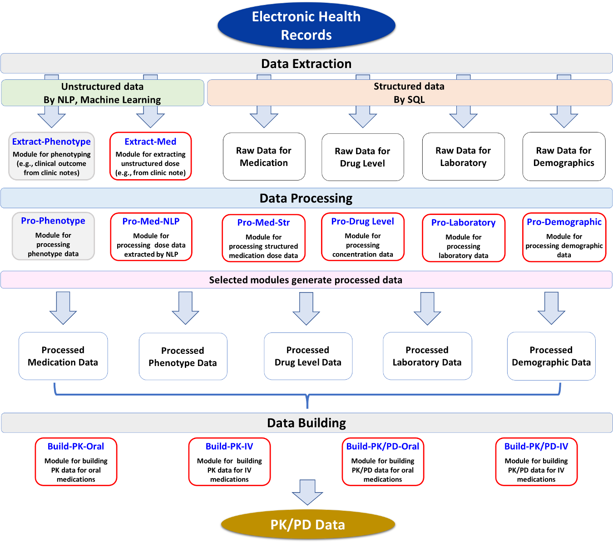

```{r setup, include=FALSE}
knitr::opts_chunk$set(echo = FALSE)

# Learn more about creating websites with Distill at:
# https://rstudio.github.io/distill/website.html

# Learn more about publishing to GitHub Pages at:
# https://rstudio.github.io/distill/publish_website.html#github-pages
#{width=10%}
```

<div>


<p align="right">
Leena Choi, PhD  
Vice Chair of Diversity and Inclusion, Department of Biostatistics  
Professor of Biostatistics
</p>
</div>

<p align="center">
<a href="https://www.vumc.org/biostatistics/person/leena-choi-phd">https://www.vumc.org/biostatistics/person/leena-choi-phd</a>
</p>

The major research focus of our lab is to construct a system for drug-related studies such as pharmacokinetics (PK), pharmacodynamics (PD), and pharmacogenomics (PGx) studies using electronic health records (EHRs), which is called "*EHRtoPKPD*". This system would allow to perform the studies more efficiently by standardizing data extraction, data processing, and data building procedures. This system would provide the foundation for PK/PD-model guided clinical decision support systems embedded in EHRs to provide an optimal pharmacotherapy, the overarching goal of precision medicine.

<div>
<figure class="rhs">

<figcaption>**The *EHRtoPKPD*, a System for PK/PD Studies using EHRs.**  
Modified from *Clin Pharm Ther 2020*.</figcaption>
</figure>

*EHRtoPKPD* is a modular system, divided into the three major procedures: data extraction ("*Extract-*"), data processing ("*Pro-*"),  and data building ("*Build-*"). Modules were created or under development (gray color box) depending on the data element, task to perform, and type of PK/PD models. For drugs with simple prescription pattern, dose data can be relatively easily extracted from e-prescription databases and processed using *Pro-Med-Str* module. However, we found that dosing data obtained from e-prescription databases often are not accurate enough for PK/PD studies. Thus, we developed more flexible and targeted NLP system that performed better than existing state-of-art NLP systems for drug dose extraction. Our NLP system was incorporated into our system (*Extract-Med* module), which can directly extract drug dose information from clinical notes, which is also available as an R package, *medExtractR*. As building drug dose data from extracted dose information can be very challenging, we developed a dose data building algorithm which was also implemented in our system (*Pro-Med-NLP*). Other data elements such as drug levels (*Pro-Drug Level*), demographics (*Pro-Demographic*), and laboratory data (*Pro-Laboratory*) can be processed using our system, and then combined with processed dose data to build PK/PD data using PK/PD data building modules (i.e., *Build-PK-IV*, *Build-PK-Oral*). The functions to run each module is implemented as R packages, *medExtractR* and *EHR*. The *EHRtoPKPD* will evolve as more modules are added.
</div>

### Lab Team

* Cole Beck
* Elizabeth McNeer
* Michael Williams
* <a href="https://www.ntjames.com/">Nathan T. James, ScM</a>


### Alumni

Hannah Weeks
